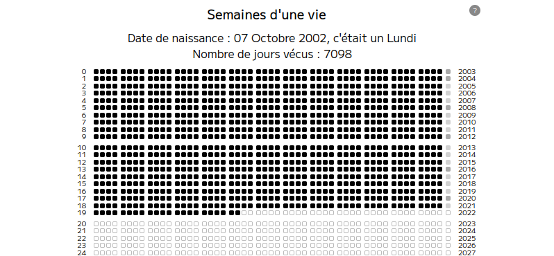

Inspiré des posters vendus pour illustrer les semaines d'un vie : ["My Life In Weeks"](https://duckduckgo.com/?q=my+life+in+weeks+poster&t=h_&iar=images&iax=images&ia=images)

# Personnalisation via paramètres d'URL

* bdate : *Birth Date*, **date de naissance**, doit être au format JJ-MM-AAAA et être une date valide
* lexp : *Life Expectancy*, **espérance de vie**, doit être un entier inférieur à 130

Voir exemple ci dessous (Démo)

En France l'espérance de vie en 2021 pour les femmes approche les 86 ans, et pour les hommes, presque 80 ([source insee](https://www.insee.fr/fr/statistiques/2416631))

# Démo 

Démo disponible ici : https://jcfrog.com/mylife

Exemple de personnalisation sur cette démo, pour une personne née le 13 septembre 1977, avec une espérance de vie supposée de 90 ans:

https://jcfrog.com/mylife/?bdate=13-09-1977&lexp=90

# Licence 

Licence cc0
